# Introduction to Containers, Docker and Kubernetes

* [Welcome](#welcome)
* [Module 1: Introduction to Containers and Docker](#module-1-introduction-to-containers-and-docker)
    * [Prerequisites](#prerequisites)
    * [Run a first Docker Helloworld](#run-a-first-docker-helloworld)
    * [Hello Helloworld](#hello-helloworld)
    * [Create a Dockerfile and Docker Image](#create-a-dockerfile-and-docker-image)
    * [Push an Image to your Docker Hub Account](#push-an-image-to-your-docker-hub-account)
    * [Update and Build a Docker Image](#update-and-build-a-docker-image)
    * [Updating and Building a Docker Image](#updating-and-building-a-docker-image)
* [Module 2](#module-2)
    * [Introduction to Kubernetes](#introduction-to-kubernetes)
    * [Prerequisites](#prerequisites-1)
* [Module 3](#module-3)
    * [Creating a real world application in Kubernetes](#creating-a-real-world-application-in-kubernetes)
    * [Prerequisites](#prerequisites-2)
* [Module 4](#module-4)
    * [Debugging Application Issues and Errors](#debugging-application-issues-and-errors)
    * [Prerequisites](#prerequisites-3)

---

## Welcome

---
## Module 1: Introduction to Containers and Docker

### Prerequisites
To run the exercises in this section, you will need to install Docker on your local machine. If you're running on a mac, the easiest way to install Docker is to install [Docker Desktop on Mac](https://docs.docker.com/docker-for-mac/install/). 

Follow the instructions on the site to install Docker Desktop.

You will need to have admin access to your workstation, and will see this dialog because Docker needs priviledged access.

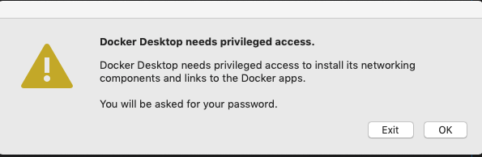

Once you click OK on this screen, you'll be prompted for your login User Name and Password.

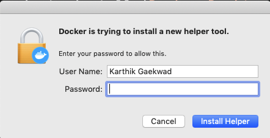

Successful installation of Docker Desktop will result in a whale icon in the mac menu bar.

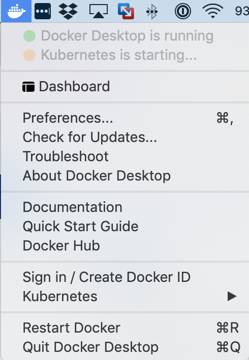

To test whether Docker was installed correctly, open your command line, and type the following command `docker --version`. You should get an appropriate version like the screenshot below (but your version might be higher than what is shown in the screenshot)

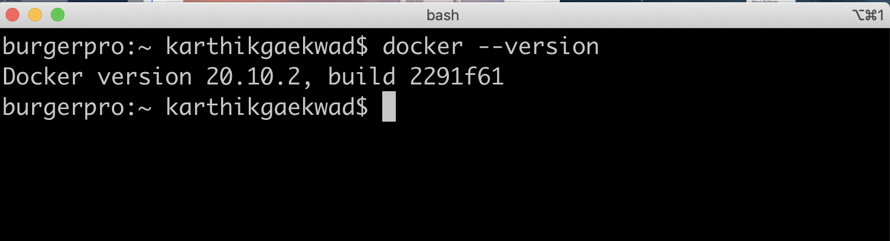

### Run a first Docker Helloworld

### Hello Helloworld

Run Docker’s Hello-world example:

	
```
$ docker run hello-world
```

Since the "hello-world" image is not available locally on the host, the command automatically pulls the hello-world image from the public Docker Hub image repository and runs the container in the foreground.

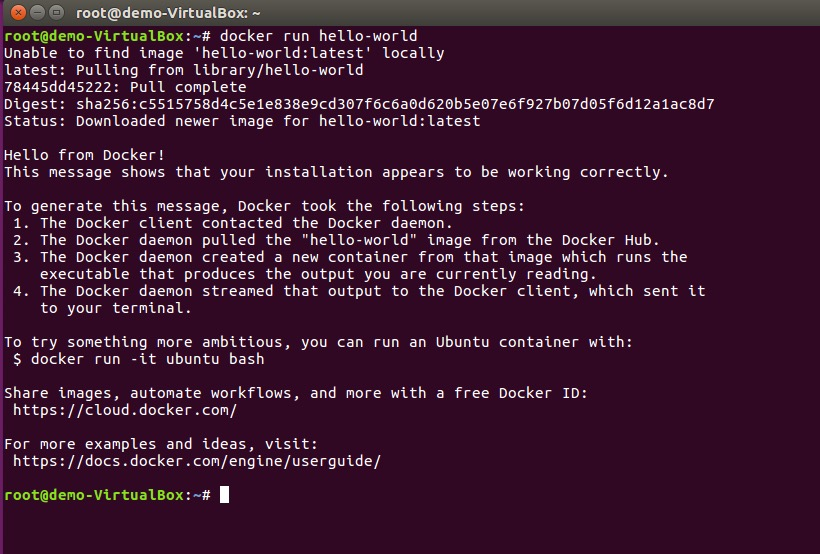

***

**Congratulations, you have just run your first Docker container!**

List all containers: 

> *Note - the "- a" option = running **and** stopped*

```
$ docker ps -a
```
Notice that the hello-world container ran once and then exited:

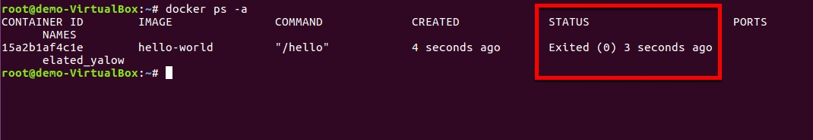

***

In this exercise you will explore another Docker image from Docker Hub.

**Browse to another public image Helloworld example on Docker Hub.  Run it.**

Use this Docker Hub image:

[https://hub.docker.com/r/karthequian/helloworld](https://hub.docker.com/r/karthequian/helloworld)

Pull the image from the Docker Hub Registry:

>  *Note - observe how the layers are pulled individually.  Docker image files are composed of multiple layers, for more information, read the [Docker docs here about images and layers](https://docs.docker.com/engine/userguide/storagedriver/imagesandcontainers/)*

```
$ docker pull karthequian/helloworld:latest
```

Copy/Paste the Docker Run command from the Docker Hub page and add a "-d" option so the container runs in "detached" mode:

> *Note - the "-d" option run the container in detached mode, as opposed to the foreground mode that you saw in the last exercise.  The benefit of this is that for longer running containers, it frees up your terminal window.*

```
$ docker run -d -p 80:80/tcp "karthequian/helloworld:latest"
```

Explore this Helloworld app in the browser.  Navigate to the IP of the Docker Host where it is running and note the number of visits: 

> *Note - the IP is the same as the Host that you are SSH’d into http://host_ip or on your localhost http://localhost (for the rest of this document, it may just be referred to as host IP or Docker host IP for simplicity)*


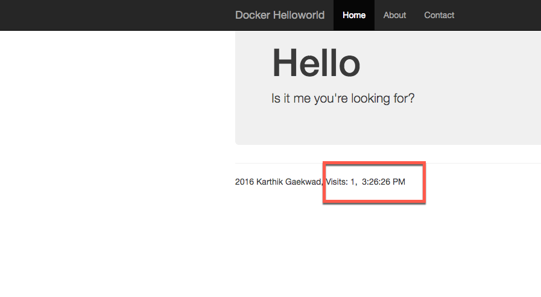

***

You are now actually using an application that is in the Docker container.  Refresh the browser and observe how the visits count increments.  This is a live application. A simple example, but an example of the experience of using an application running in a container, which is no different than if it was not running in a container.

> *Makes you wonder about how many apps that you are using on a day to day basis, may indeed be running in a Docker container?*

Now, look at the name that Docker has assigned the Helloworld container that is running.  

List all running containers:

```
$ docker ps
```

Notice that Docker has assigned a container name, something like "ecstatic_lamport" in the below?  What name did Docker give your container?  Remember this name, as we will use it in a bit.

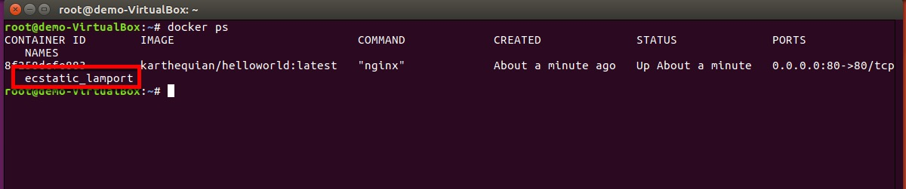

***

> *Note - unless you specify a container name, Docker will assign a similar 2 part name automatically*

**Stop and Re-run Your Container with a More Descriptive Name**

Now, go back to the terminal window, stop the container and give it a more descriptive name, so that we could find it easier if there were many containers running.

Stop the Running Container - Replace **your_container** below with an actual name of your running container:

```
$ docker stop your_container
```

Now, remove the container with the "rm" command:

```
$ docker rm your_container
```

Check to be sure that the container has been removed:

```
$ docker ps -a
```

> *Note - containers can be stopped and removed by using their name **(if there are no dependent image layers)**, their long id or their short id*

Now run the container with a more descriptive name, such as "helloworld_app":

```
$ docker run -d --name helloworld_app -p 80:80/tcp "karthequian/helloworld:latest"
```

List all running containers again:

```
$ docker ps
```

> *Is the container easier to find now, especially that there is context to the name of the container?  Especially if there were many containers running?*

Stop and Remove the container:

```
$ docker stop helloworld_app

$ docker rm helloworld_app
```

We are done with this part of the HOL.

***

### Create a Dockerfile and Docker Image

In this exercise you will build your own image from a Dockerfile.

**About DockerFiles**

A Dockerfile is a recipe that starts with a base image, typically a thin Linux OS distribution such as Alpine Linux, and then layers on an app and configuration.  [According to Docker](https://docs.docker.com/engine/reference/builder/): 

*"Dockerfile is a text document that contains all the commands a user could call on the command line to assemble an image. Using docker build users can create an automated build that executes several command-line instructions in succession."*

**Build the Docker image**

Use the [Docker Whalesay](https://hub.docker.com/r/docker/whalesay/) example to build your first image.  

Follow these steps:

From your home directory, make a directory to store your Dockerfile:

```
$ cd ~ 

$ mkdir mydockerbuild
```

Change to the new directory:

```
$ cd mydockerbuild
```

In Step 1.3, use VI or editor of your choice, like nano.  

Use VI, if you are on Oracle Linux:

> *Note - case is important in the file name "Dockerfile".  Use a capital D and lower case for the rest of the letters.*

```
$ vi Dockerfile
```

Create a text file named Dockerfile with these 3 lines:

> *Note - if you are using VI, press the "i" key first to enter insert mode, before you paste.

```
FROM docker/whalesay:latest

RUN apt-get -y update && apt-get install -y fortunes

CMD /usr/games/fortune -a | cowsay
```

In Step 1.8, after you are done adding the 3 lines to your Dockerfile with VI, save the file by typing the Esc key - colon - w (for write) - q (for quit):

	
```
esc : w q 
```

Verify the Dockerfile has the correct content:

```
$ cat Dockerfile
```

> *Note - the docs for VI are here: [https://www.cs.colostate.edu/helpdocs/vi.html](https://www.cs.colostate.edu/helpdocs/vi.html)*

Then per section 2, build your Docker image, be sure to include the "." at the end of the command:

```
$ docker build -t docker-whale .
```

Then per section 4, list the images on your host and run the docker-whale image as a container:

```
$ docker images
```

```
$ docker run docker-whale
```

Notice the output in the terminal, the container will run once, then stop.

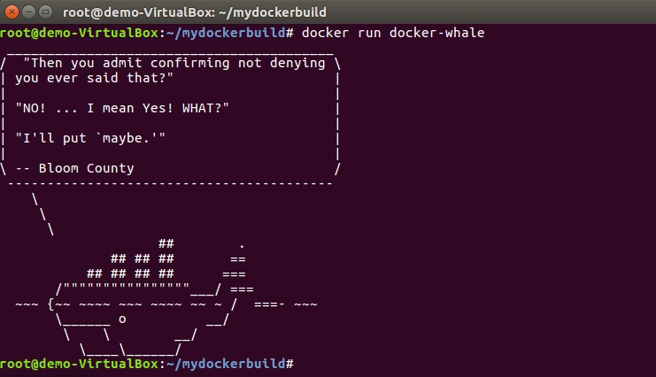 

***

### Push an Image to your Docker Hub Account

**Registries**

Registries store Docker images.  Using a registry is the first step towards moving Docker off the laptop.  The most widely used registry is the Docker Hub: [https://hub.docker.com](https://hub.docker.com) 

> *Note - in this exercise you will need a Docker Hub account to use the public Docker registry.  If you do not have one already, you can sign up for free, navigate to: [https://hub.docker.com/](https://hub.docker.com/)*

**Tag and Push your new image to the Docker Hub registry.  In this exercise username will be your Docker Hub account name.**

First, log into your Docker Hub account from the terminal:

```
$ docker login
```

When prompted, enter your Docker account username (lowercase), password and email

Now, tag and push your new docker-whale image to your account on Docker Hub

Substitute your Docker **username** below

```
$ docker tag docker-whale:latest username/docker-whale:latest
```

Push the Docker image to your account.  This will create a new repository called "docker-whale" for this image.

```
$ docker push username/docker-whale:latest
```

Navigate to your account page in Docker Hub via this URL, substituting your **username**:

[https://hub/docker.com/r/username](https://hub.docker.com/r/username)

Do you see the image that you pushed?

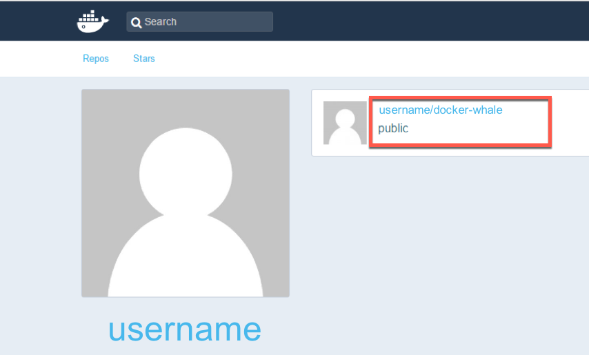

***

Now, remove the local image and force the image to be pulled and run from the Docker Hub registry.

To do this, you must first remove the stopped container by using its short id, not its name.  Find the short id:

```
$ docker ps -a 
```

Copy the short id for the appropriate container, it will be similar to this format: ee31fe1dd8f8 and use the "rm" command to remove the container: 

```
$ docker rm short_id
```

Now that the container is removed, you can remove the image locally on the host, and force the container to be run from the image on the Docker Hub.  Use the "rmi" command to remove an image.

Remove the image locally that you pushed to the Docker Hub:

```
$ docker rmi username/docker-whale
```

Verify the images are removed from your host.  View all Docker images with the images command:

```
$ docker images
```

Now, run the image directly from your repository on Docker Hub, and force a new pull of the image, because the image does not exist locally:

```
$ docker run username/docker-whale
```

> *Note - if no tag is used, the default tag is "latest", and it is pulled from your registry*

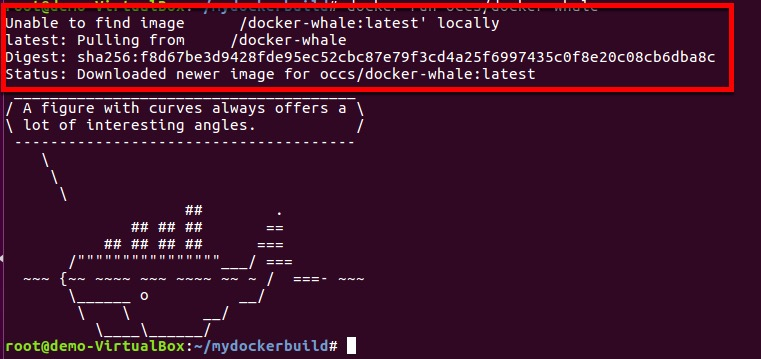

***

**At this point please stop and remove all containers.  To do this for all containers, use these commands:**

```
$ docker stop $(docker ps -a -q)

$ docker rm $(docker ps -a -q)
```

***

### Update and Build a Docker Image

Now that we know how to run a container based on an image, let's update and run a 

### Updating and Building a Docker Image


## Module 2- Introduction to Kubernetes
### Prerequisites
For this section, we will need to install 2 tools that allow you to run and interact with a Kubernetes cluster locally.

#### kubectl

Kubectl is the Kubernetes command line tool that allows you to run commands against a Kubernetes cluster. 

On a mac, you can easily install kubectl following along with [the install document](https://kubernetes.io/docs/tasks/tools/install-kubectl/#install-kubectl-on-macos). 

There are multiple ways to do this- I prefer the curl method because I can get the latest stable version of kubectl installed on my machine, but the brew install way works just as well.

To test whether kubectl was installed correctly, open your command line, and type the following command `kubectl version --client`. You should get an appropriate version like the screenshot below (but your version might be higher than what is shown in the screenshot).

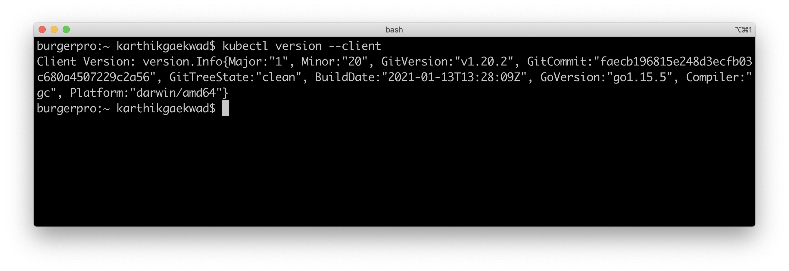

#### minikube


## Module 3- Creating a real world application in Kubernetes
### Prerequisites

## Module 4- Debugging Application Issues and Errors

### Prerequisites


