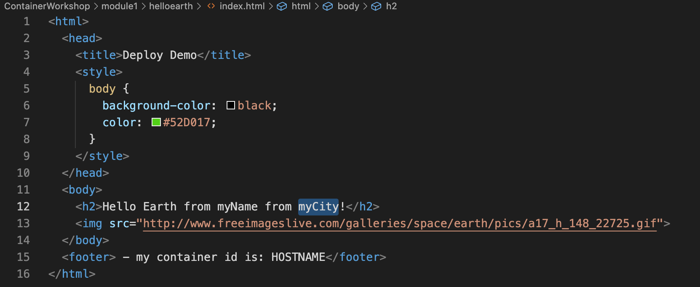
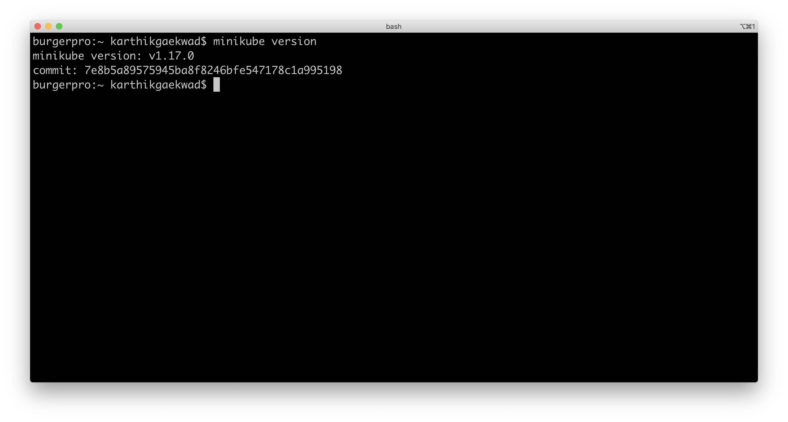

# Introduction to Containers, Docker and Kubernetes

   * [Introduction to Containers, Docker and Kubernetes](#introduction-to-containers-docker-and-kubernetes)
   * [Welcome](#welcome)
   * [Module 1: Introduction to Containers and Docker](#module-1-introduction-to-containers-and-docker)
      * [Prerequisites](#prerequisites)
      * [Run a first Docker Helloworld](#run-a-first-docker-helloworld)
      * [Hello Helloworld](#hello-helloworld)
      * [Create a Dockerfile and Docker Image](#create-a-dockerfile-and-docker-image)
      * [Push an Image to your Docker Hub Account](#push-an-image-to-your-docker-hub-account)
      * [Update and Build a Docker Image](#update-and-build-a-docker-image)
      * [Updating and Building a Docker Image](#updating-and-building-a-docker-image)
   * [Module 2- Introduction to Kubernetes](#module-2--introduction-to-kubernetes)
      * [Prerequisites](#prerequisites-1)
      * [kubectl](#kubectl)
      * [minikube](#minikube)
      * [Start minikube](#start-minikube)
      * [Set up your helloworld](#set-up-your-helloworld)
      * [Setting up a Service](#setting-up-a-service)
      * [Cleaning up your resources](#cleaning-up-your-resources)
      * [Commands run in this section](#commands-run-in-this-section)
   * [Module 3- Creating a real world application in Kubernetes](#module-3--creating-a-real-world-application-in-kubernetes)
      * [Prerequisites](#prerequisites-2)
      * [Dealing with Environment Variables](#dealing-with-environment-variables)
      * [Configurations via configmaps](#configurations-via-configmaps)
         * [Learn how to declare a configmap](#learn-how-to-declare-a-configmap)
         * [Understand how to call a configmap from a deployment](#understand-how-to-call-a-configmap-from-a-deployment)
      * [Configurations via secrets](#configurations-via-secrets)
         * [Learn how to declare a secret](#learn-how-to-declare-a-secret)
         * [Understand how to add a secret to a deployment](#understand-how-to-add-a-secret-to-a-deployment)
      * [Running a bigger example](#running-a-bigger-example)
   * [Module 4- Debugging Application Issues and Errors](#module-4--debugging-application-issues-and-errors)
      * [Prerequisites](#prerequisites-3)
      * [Kubernetes Techniques](#kubernetes-techniques)
      * [Looking at logs](#looking-at-logs)
      * [Executing commands in a container](#executing-commands-in-a-container)
   * [Module 5- Advanced Topics](#module-5--advanced-topics)
      * [Typical development workflow for Kubernetes](#typical-development-workflow-for-kuberentes)
      * [Using Amazon Elastic Container Registry](#using-amazon-elastic-container-registry)
      * [Using Helm Charts](#using-helm-charts)


---

# Welcome

---
# Module 1: Introduction to Containers and Docker

## Prerequisites
To run the exercises in this section, you will need to install Docker on your local machine. If you're running on a mac, the easiest way to install Docker is to install [Docker Desktop on Mac](https://docs.docker.com/docker-for-mac/install/). 

Follow the instructions on the site to install Docker Desktop.

You will need to have admin access to your workstation, and will see this dialog because Docker needs privileged access.


Once you click OK on this screen, you'll be prompted for your login User Name and Password.


Successful installation of Docker Desktop will result in a whale icon in the mac menu bar.


To test whether Docker was installed correctly, open your command line, and type the following command `docker --version`. You should get an appropriate version like the screenshot below (but your version might be higher than what is shown in the screenshot)


## Run a first Docker Helloworld

## Hello Helloworld

Run Docker’s Hello-world example:

	
```
$ docker run hello-world
```

Since the "hello-world" image is not available locally on the host, the command automatically pulls the hello-world image from the public Docker Hub image repository and runs the container in the foreground.


***

**Congratulations, you have just run your first Docker container!**

List all containers: 

> *Note - the "- a" option = running **and** stopped*

```
$ docker ps -a
```
Notice that the hello-world container ran once and then exited:


***

In this exercise you will explore another Docker image from Docker Hub.

**Browse to another public image Helloworld example on Docker Hub.  Run it.**

Use this Docker Hub image:

[https://hub.docker.com/r/karthequian/helloworld](https://hub.docker.com/r/karthequian/helloworld)

Pull the image from the Docker Hub Registry:

>  *Note - observe how the layers are pulled individually.  Docker image files are composed of multiple layers, for more information, read the [Docker docs here about images and layers](https://docs.docker.com/engine/userguide/storagedriver/imagesandcontainers/)*

```
$ docker pull karthequian/helloworld:latest
```

Copy/Paste the Docker Run command from the Docker Hub page and add a "-d" option so the container runs in "detached" mode:

> *Note - the "-d" option run the container in detached mode, as opposed to the foreground mode that you saw in the last exercise.  The benefit of this is that for longer running containers, it frees up your terminal window.*

```
$ docker run -d -p 80:80/tcp "karthequian/helloworld:latest"
```

Explore this Helloworld app in the browser.  Navigate to the IP of the Docker Host where it is running and note the number of visits: 

> *Note - the IP is the same as the Host that you are SSH’d into http://host_ip or on your localhost http://localhost (for the rest of this document, it may just be referred to as host IP or Docker host IP for simplicity)*


***

You are now actually using an application that is in the Docker container.  Refresh the browser and observe how the visits count increments.  This is a live application. A simple example, but an example of the experience of using an application running in a container, which is no different than if it was not running in a container.

> *Makes you wonder about how many apps that you are using on a day to day basis, may indeed be running in a Docker container?*

Now, look at the name that Docker has assigned the Helloworld container that is running.  

List all running containers:

```
$ docker ps
```

Notice that Docker has assigned a container name, something like "ecstatic_lamport" in the below?  What name did Docker give your container?  Remember this name, as we will use it in a bit.


***

> *Note - unless you specify a container name, Docker will assign a similar 2 part name automatically*

**Stop and Re-run Your Container with a More Descriptive Name**

Now, go back to the terminal window, stop the container and give it a more descriptive name, so that we could find it easier if there were many containers running.

Stop the Running Container - Replace **your_container** below with an actual name of your running container:

```
$ docker stop your_container
```

Now, remove the container with the "rm" command:

```
$ docker rm your_container
```

Check to be sure that the container has been removed:

```
$ docker ps -a
```

> *Note - containers can be stopped and removed by using their name **(if there are no dependent image layers)**, their long id or their short id*

Now run the container with a more descriptive name, such as "helloworld_app":

```
$ docker run -d --name helloworld_app -p 80:80/tcp "karthequian/helloworld:latest"
```

List all running containers again:

```
$ docker ps
```

> *Is the container easier to find now, especially that there is context to the name of the container?  Especially if there were many containers running?*

Stop and Remove the container:

```
$ docker stop helloworld_app

$ docker rm helloworld_app
```

We are done with this part of the exercise.

***

## Create a Dockerfile and Docker Image

In this exercise you will build your own image from a Dockerfile.

**About DockerFiles**

A Dockerfile is a recipe that starts with a base image, typically a thin Linux OS distribution such as Alpine Linux, and then layers on an app and configuration.  [According to Docker](https://docs.docker.com/engine/reference/builder/): 

*"Dockerfile is a text document that contains all the commands a user could call on the command line to assemble an image. Using docker build users can create an automated build that executes several command-line instructions in succession."*

**Build the Docker image**

Use the [Docker Whalesay](https://hub.docker.com/r/docker/whalesay/) example to build your first image.  

Follow these steps:

From your home directory, make a directory to store your Dockerfile:

```
$ cd ~ 

$ mkdir mydockerbuild
```

Change to the new directory:

```
$ cd mydockerbuild
```

In Step 1.3, use VI or editor of your choice, like nano.  

Use VI, if you are on Oracle Linux:

> *Note - case is important in the file name "Dockerfile".  Use a capital D and lower case for the rest of the letters.*

```
$ vi Dockerfile
```

Create a text file named Dockerfile with these 3 lines:

> *Note - if you are using VI, press the "i" key first to enter insert mode, before you paste.

```
FROM docker/whalesay:latest

RUN apt-get -y update && apt-get install -y fortunes

CMD /usr/games/fortune -a | cowsay
```

In Step 1.8, after you are done adding the 3 lines to your Dockerfile with VI, save the file by typing the Esc key - colon - w (for write) - q (for quit):

	
```
esc : w q 
```

Verify the Dockerfile has the correct content:

```
$ cat Dockerfile
```

> *Note - the docs for VI are here: [https://www.cs.colostate.edu/helpdocs/vi.html](https://www.cs.colostate.edu/helpdocs/vi.html)*

Then per section 2, build your Docker image, be sure to include the "." at the end of the command:

```
$ docker build -t docker-whale .
```

Then per section 4, list the images on your host and run the docker-whale image as a container:

```
$ docker images
```

```
$ docker run docker-whale
```

Notice the output in the terminal, the container will run once, then stop.

 

***

## Push an Image to your Docker Hub Account

**Registries**

Registries store Docker images.  Using a registry is the first step towards moving Docker off the laptop.  The most widely used registry is the Docker Hub: [https://hub.docker.com](https://hub.docker.com) 

> *Note - in this exercise you will need a Docker Hub account to use the public Docker registry.  If you do not have one already, you can sign up for free, navigate to: [https://hub.docker.com/](https://hub.docker.com/)*

**Tag and Push your new image to the Docker Hub registry.  In this exercise username will be your Docker Hub account name.**

First, log into your Docker Hub account from the terminal:

```
$ docker login
```

When prompted, enter your Docker account username (lowercase), password and email

Now, tag and push your new docker-whale image to your account on Docker Hub

Substitute your Docker **username** below

```
$ docker tag docker-whale:latest username/docker-whale:latest
```

Push the Docker image to your account.  This will create a new repository called "docker-whale" for this image.

```
$ docker push username/docker-whale:latest
```

Navigate to your account page in Docker Hub via this URL, substituting your **username**:

[https://hub/docker.com/r/username](https://hub.docker.com/r/username)

Do you see the image that you pushed?


***

Now, remove the local image and force the image to be pulled and run from the Docker Hub registry.

To do this, you must first remove the stopped container by using its short id, not its name.  Find the short id:

```
$ docker ps -a 
```

Copy the short id for the appropriate container, it will be similar to this format: ee31fe1dd8f8 and use the "rm" command to remove the container: 

```
$ docker rm short_id
```

Now that the container is removed, you can remove the image locally on the host, and force the container to be run from the image on the Docker Hub.  Use the "rmi" command to remove an image.

Remove the image locally that you pushed to the Docker Hub:

```
$ docker rmi username/docker-whale
```

Verify the images are removed from your host.  View all Docker images with the images command:

```
$ docker images
```

Now, run the image directly from your repository on Docker Hub, and force a new pull of the image, because the image does not exist locally:

```
$ docker run username/docker-whale
```

> *Note - if no tag is used, the default tag is "latest", and it is pulled from your registry*


***

**At this point please stop and remove all containers.  To do this for all containers, use these commands:**

```
$ docker stop $(docker ps -a -q)

$ docker rm $(docker ps -a -q)
```

***

## Update and Build a Docker Image

Now that we know how to run a container based on an image, let's update, build and run our first container.

Navigate to the `/module1/helloearth` directory to see 3 files- 

* Dockerfile- holds the instructions for how to build the container
* index.html- has the code that you want to deploy
* start.sh- the initial script to run when the container comes online

Open the `index.html` page, and update the "myCity" to your city, as shown below.


Once the index page is updated, it's time to build the docker image by using the `docker build` command below.  

```
docker build -t <username>/helloearth:latest .
```

If you have a docker hub username, you can replace <username> with your dockerhub username.

Take a look at your docker images by running the command below to verify that your image exists.

```
docker images

```

To run this image (where username is the docker hub username):

```
docker run -d -p 80:80/tcp <username>/helloearth:latest
```

---

# Module 2- Introduction to Kubernetes

## Prerequisites
For this section, we will need to install 2 tools that allow you to run and interact with a Kubernetes cluster locally.
## kubectl

kubectl is the Kubernetes command line tool that allows you to run commands against a Kubernetes cluster. 

On a mac, you can install kubectl following along with [the install document](https://kubernetes.io/docs/tasks/tools/install-kubectl/#install-kubectl-on-macos). 

There are multiple ways to do this- I prefer the curl method because I can get the latest stable version of kubectl installed on my machine, but the brew install way works just as well.

To test whether kubectl was installed correctly, open your command line, and type the following command `kubectl version --client`. You should get an appropriate version like the screenshot below (but your version might be higher than what is shown in the screenshot).


## minikube

minikube is a tool that allows you to run a single node Kubernetes cluster on your machine. It's primary usecase is to help users learn about Kubernetes and work with Kubernetes locally.

On a mac, you can install minikube following along the [Official Install documents](https://minikube.sigs.k8s.io/docs/start/#what-youll-need). 

Again you can use the `curl` or the `brew install` method as shown on the site- I once again prefer the curl method because I can get the latest stable version of minikube.

To test whether minikube was installed correctly, open your command line, and type the following command `minikube version`. You should get an appropriate version like the screenshot below (but your version might be higher than what is shown in the screenshot).



## Start minikube

Run the command 
```
minikube start --driver=hyperkit
```

This command sets up a Kubernetes dev environment for you via hyperkit (on mac). There are other drivers that can be used here as well like the docker, Virtualbox or ssh. 

The last statement in the output states that kubectl can talk to minikube. We can verify this by running the command `kubectl get nodes`

This will show you that minikube is ready to use.


## Set up your helloworld

Make sure you have your files unzipped to your local machine (for example /documents/ContainerWorkshop). You should be in your existing directory with the exercise files for module2 as shown below.

```
$ pwd
/Users/karthikgaekwad/Documents/work/github.com/karthequian/ContainerWorkshop/module2
$ ls -al
total 8
drwxr-xr-x  3 karthikgaekwad  staff   96 Jan 23 19:15 .
drwxr-xr-x  8 karthikgaekwad  staff  256 Jan 23 19:15 ..
-rw-r--r--  1 karthikgaekwad  staff  449 Jan 23 19:16 helloworld.yaml
```

We will run one of the most common Docker helloworld applications out there- [https://hub.docker.com/r/karthequian/helloworld/]

To run this, type:

```
kubectl create -f helloworld.yaml
```

This command creates a deployment resource from the file helloworld.yaml, which, in this case, contains a deployment called "helloworld", pulling from the image karthequian/helloworld, and exposes port 80 of the container to the pod.

Running this command will give you this output, stating that the deployment "hw" was created.

```
$ kubectl create -f helloworld.yaml 
deployment.apps/helloworld created
```

To view the running resources, the following commands are helpful. 

To view the pods running, you can run `kubectl get pods`. This will return all the pods running in the default namespace in Kubernetes including the pods from the helloworld deployment.

To view the replicasets running, you can run `kubectl get replicasets`. This will return all the replicasets running in the default namespace in Kubernetes including the pods from the helloworld deployment.

To view the deployments running, you can run `kubectl get deployments`. This will return all the deployments running in the default namespace in Kubernetes including the pods from the helloworld deployment.

We can run the command `kubectl get all` to see all our resources running.

## Setting up a Service
You'll notice that in the `kubectl get all` command, the deployment and pods are running, but it doesn't show you how to access the application.

This is because we have not defined a service for the deployment. To make the helloworld container accessible outside the Kubernetes virtual network, you have to expose the deployment as a Kubernetes service.

To do this, we can expose the pod to the public internet using the kubectl expose command 
`kubectl expose deployment helloworld --type=NodePort`

The `--type=NodePort` flag exposes the deployment outside of the cluster. If you're using this on a cloud provider, you can use a `--type=LoadBalancer` that will provision an external IP address would be provisioned to access the service.

To view the final user interface, use the minikube service command.

`minikube service helloworld`

This will open your web browser to your application that is running in Kubernetes!

## Cleaning up your resources

To delete the deployments and services, you can run the `kubectl delete` command. For example, to delete an individual service, you can run the command `kubectl delete service <service-name>`. 

To delete our helloworld service, run `kubectl delete service helloworld`.

To verify that the helloworld service was deleted, run the command `kubectl get services`, and check to see if the service is still there; most likely the service will either be in a deleting state, or not be in the list.

Similar to the `apply` and `create` commands, you can also pass a filename as well. For example, similar to the way the deployment was created from the helloworld.yaml file, run the delete `kubectl delete -f helloworld.yaml` to delete all resources mentioned in the file.

## Commands run in this section

```
kubectl get all
kubectl create -f helloworld.yaml
kubectl expose deployment helloworld --type=NodePort
minikube service helloworld
kubectl delete service helloworld
kubectl delete -f helloworld.yaml
```

---
# Module 3- Creating a real world application in Kubernetes
## Prerequisites

There are no prerequisites for this section

## Dealing with Environment Variables
Applications that require parameterized values are sent to the application via environment variables. 

The Environment variables are read by the application in 2 ways:

a) At startup time, if the Dockerfile is configured to pass the value of the env to the application startup.
b) The application has code to read the specific value of the env variable.

To see an example, run the following file:

```
kubectl create -f reader-deployment-with-env.yaml
```

This creates a deployment with an env section as shown below:

```
        env:
        - name: log_level
          value: "error"
```

This is essentially sending an env variable called "log_level" to the container environment with the value "error".

To check whether this is the case, exec into the pod by first getting the name of the pod for the `logreader` deployment using the command

```
kubectl get pod
```

Next, exec into the container with the following command:

```
kubectl exec -it PODNAME -- bash
```

where PODNAME is the name of the `logreader` pod.

Once inside the container environment, run the command `env` to list all the environment variables in the container. One of these variables will be `log_level` with the value `error`.

## Configurations via configmaps

### Learn how to declare a configmap
Applications require a way for us to pass data to them that can be changed at deploy time. Examples of this might be log-levels or urls of external systems that the application might need at startup time. Instead of hardcoding these values, we can use a configmap in kubernetes, and pass these values as environment variables to the container.

We will take an example of "log_level", and pass the value "debug" to a pod via a configmap in this example.

To create a configmap for this literal type 
```
kubectl create configmap logger --from-literal=log_level=debug
```

To see all your configmaps: 
```
kubectl get configmaps
```

To read the value in the logger configmap: 
```
kubectl get configmap/logger -o yaml
```

To edit the value, we can run 
```
kubectl edit configmap/logger
```

### Understand how to call a configmap from a deployment
Adding a configmap to a deployment is done via environment variables. Instead of sending a value for the env, we can pass a configmap.

Open up the `reader-configmap-deployment.yaml` file. Note the `env` section that looks like:

```
        env:
        - name: log_level
          valueFrom:
            configMapKeyRef:
              name: logger #Read from a configmap called logger
              key: log_level  #Read the key called log_level
```

The `valueFrom` section declares that the value is populated via a `configMapKeyRef`. The name of the configmap is declared as well as the key to use in that section.

Run the application with the command below:

```
kubectl create -f reader-configmap-deployment.yaml
```

To view the logs, run the command:
```
kubectl logs <pod-name>
```

## Configurations via secrets

### Learn how to declare a secret

Just like configuration data, applications require other data that might be of more sensitive in nature- for example database passwords, or API tokens. Passing these in the yaml for a deployment or pod would make them visible to everyone.

In these usecases, use a secret to encapsulate sensitive data.

To create a secret: 
```
kubectl create secret generic apikey --from-literal=api_key=123456789
```

Notice that we can't read the value of the secret directly:
```
kubectl get secret apikey -o yaml
```

### Understand how to add a secret to a deployment

Adding a secret to a deployment is similar to what we did for configmaps. You can add a secret to the env portion, and start up the deployment with:

```
kubectl create -f secretreader-deployment.yaml
```

## Running a bigger example

In this section, we'll take the popular Kubernetes guestbook, and attempt to run it! You can read more about the guestbook here: [https://kubernetes.io/docs/tutorials/stateless-application/guestbook/](https://kubernetes.io/docs/tutorials/stateless-application/guestbook/)


Load up the guestbook by running the command: 
```
minikube service frontend
```

The output would look like this:
```
$ minikube service frontend
|-----------|----------|-------------|---------------------------|
| NAMESPACE |   NAME   | TARGET PORT |            URL            |
|-----------|----------|-------------|---------------------------|
| default   | frontend |          80 | http://192.168.64.2:31824 |
|-----------|----------|-------------|---------------------------|
🎉  Opening service default/frontend in default browser...
```

---
# Module 4- Debugging Application Issues and Errors
## Prerequisites

There are no prerequisites for this section

## Kubernetes Techniques
When things are not deploying as expected, or things seem to be taking a while, start by describing the deployments and pods associated with the deployments to look for errors.

Run the helloworld application that is bundled with this section by typing:

```
kubectl create -f ./module4/helloworld-deployment-with-bad-pod.yaml
```

As it's starting up, run the command: 

```
kubectl get deployments
``` 

followed by 

```
kubectl describe deployment bad-helloworld-deployment
```

Notice that there are 0 available pods in the deployment. This indicates that there is something wrong going on with the pod.

Introspect the pods with a ```kubectl get pods```, and notice that the `bad-helloworld-deployment` pod is in an image pull backoff state and isn't ready.

Describing the pod with `kubectl describe pod bad-helloworld-deployment-7bb4b7466-f6nkm`, will indicate that kubernetes is having trouble pull the pod from the repository, either because it doesn't exist, or because we're missing the repository credentials.

## Looking at logs
Another technique to track pod progress is looking at the log files for a pod. If you write your logs to standard out, you can get to them by the command `kubectl logs <pod_name>`. This will return the log statements that are being written by your application in the pod.

To practice, deploy the `helloworld-all` deployment and service with the command:

```
kubectl apply -f ./module4/helloworld-all.yaml
```

Observe the pods for the deployment with the following command:

```
kubectl get pods 
```

Find the pod related to the helloworld deployment, and look at the logs associated with the pod by using the following command:

```
kubectl logs <pod_name>
```

You can also get a live tail of these logs by using the `-f` option as shown below:

```
kubectl logs -f <pod_name>
```

Access the URL for the application in the web browser and see if more logs are populated.

```
minikube service helloworld-all-service
```

## Executing commands in a container
Finally, sometimes it is necessary to exec into the actual container running the pod to look for errors, or state. To do this, run the exec command 
```
kubectl exec -it <pod-name> -c <container-name> -- /bin/bash
``` 

where -it is an interactive terminal and -c is the flag to specify the container name. Finally we want a bash style terminal.

This drops us into the container, and we can introspect into the details of our application.

---

# Module 5- Advanced Topics

## Typical development workflow for Kubernetes

## Using Amazon Elastic Container Registry

Demo the Amazon ECR. 

Pull a public image on the ECR with the command:

```
docker pull public.ecr.aws/u6p0h3r2/karthequian:latest
```

## Using Helm Charts

Helm is a package manager for Kubernetes.

- Demo using Helm:  [https://helm.sh/](https://helm.sh/)
- Run through an install of Helm

To create a sample helm chart named helloworld-helm type:

```
helm create helloworld-helm
```

This will create a folder with 
```
helloworld-helm /
  Chart.yaml
  values.yaml
  templates /
  charts /
  .helmignore
```

The structure of this folder is as follows:

- Chart.yaml: Main file that contains the description of our chart
- values.yaml: Contains the default values for our chart
- templates: Directory where Kubernetes resources are defined as templates
- charts: Optional directory that may contain sub-charts
- .helmignore: Define patterns to ignore when packaging (like .gitignore)


---